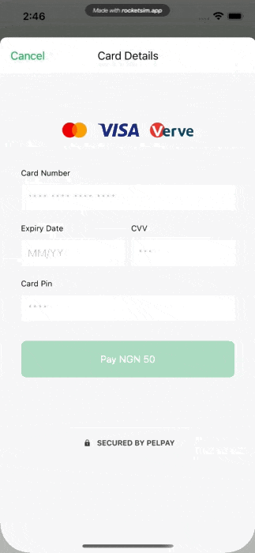
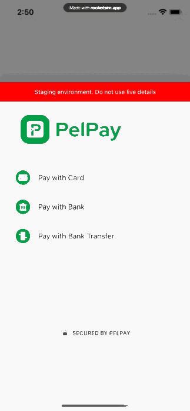

# Pelpay iOS SDK
Welcome to Pelpay's iOS SDK. This library will help you accept card and alternative payments in your iOS app.

## Features
- Highly customizable: Change look & feel of the SDK to suit your brand, set your own logo
- Multiple payment methods
- 3D-Secure & many more

| Pay VIA Credit Card | Pay VIA Bank Payment | Pay VIA Bank Transfer |
| ------------- | ------------- | ------------- |
|   |   ||


**Important: **
**The Pelpay iOS SDK permits a deployment target of iOS version 9.0 or higher**.
## Supported Payment Methods
- Credit Card
- Bank Payment
- Bank Transfer
## Installation
- Cocopods
- Swift Package Manager
### Install and Configure the SDK
1. Add the dependency (Cocopods)
```
target 'MyApp' do
  pod 'Pelpay'
end

```
1. Add dependency (Swift Package Manager)

Select **File** → **Swift Packages** → **Add Package Dependency**…. Paste the Git Repository URL: **https://github.com/Chams-Switch/pelpay-ios.git**. The click **Next**.

Depending on your GitHub settings, you may need to authenticate your SSH key here. Then, under Rules, make sure Up to Next Major is selected for the version 1.0.2. Click Next.

If you want to learn more about major and minor versioning check out semver.org. After Xcode fetches the package, ensure the Pelpay product is selected and added to the project target target. Then select Finish.

### Configure your Pelpay integration
**Step 1**: Configure Client ID, Client Secret & Integration Key
After installation of the Pelpay SDK, configure it with your Client ID, Client Secret & Integration Key gotten from your merchant dashboard, for both test and production

#### Sample Integration (Swift)
```swift
import UIKit
import Pelpay

class ViewController: UIViewController, PelpaySdkCallback {
    
    override func viewDidLoad() {
        super.viewDidLoad()
        // Do any additional setup after loading the view.
    }
    
    @IBAction func onTapTest(_ sender: Any) {
        
          //1. Set the Transaction, each field is important and must not be nil
        PelpaySdk.shared.setTransaction(integrationKey: "INTEGRATION_KEY_FROM_MERCHANT_DASHBOARD", amount: 50, currency: "NGN", merchantReference: UUID().uuidString, narration: "Narration", callackUrl: "http://localhost.com", productCode: "SSD", splitCode: "", shouldTokenise: false)
        
        //2. Set the Customer, each field is important and must not be nil
        PelpaySdk.shared.setCustomer(customerID: "xxx", customerLastName: "olajuwon", customerFirstName: "adeoye", customerEmail: "olajuwon@yopmail.com", customerPhoneNumber: "07039544295", customerAddress: "16 Egbeda Road", customerCity: "Lagos", customerStateCode: "LA", customerPostalCode: "12345", customerCountryCode: "NG")
        
        
        //3. Initialize the SDK
        PelpaySdk.shared.initialise(
            withEnvironment: Environment.Staging,
            withClientId: "CLIENT_ID_FROM_MERCHANT_DASHBOARD",
            withClientSecret: "CLIENT_SECRET_FROM_MERCHANT_DASHBOARD",
            withController: self).setBrandPrimaryColor(color: UIColor.darkGray).setHidePelpayLogo(isHidden: false).withCallBack(callback: self)
    }
    
    
    func onPaymentSuccess(adviceReference: String?) {
        print("PELPAYSDK onPaymentSuccess: \(adviceReference ?? "")")
    }
    
    func onPaymentError(errorMessage: String?) {
        print("PELPAYSDK onPaymentError: \(errorMessage ?? "")")
    }
    
    
}

```
---

##### Optional (You can add a merchant logo)
To do this, after the `.setHidePelpayLogo(isHidden: false)` call:

```swift
            .setMerchantLogo(merchantLogo: UIImage)
```

**Note** : Ensure when going live, you change the implementation from Staging `Environment.Staging` to production `Environment.Production`. 
Also ensure you don't use staging credentials on production

**Demo**

Use the `5061 2000 0000 0000 195` test card number to trigger an OTP payment flow with CVV/CVC: `109` future expiration date: `12/2025`, Pin: `1234`

Use the `4456 5300 0000 0007` test card number to trigger a 3D Secure payment flow with CVV/CVC: `444` future expiration date: `12/2025`, Pin: `1234`

Use the *WEMA BANK* with Account number `0238681912` to test bank transactions.

OTP: `123456`


---
